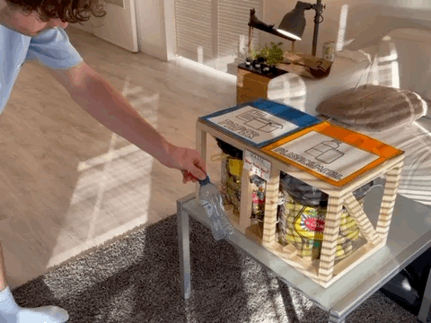
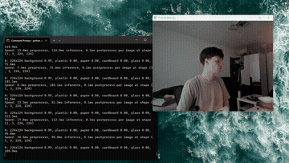

# W.A.S.T.E.

**Waste Assessment and Sorting Technology Engine**

W.A.S.T.E. is an intelligent, camera-powered trash can that identifies and sorts waste materials using real-time image classification and servo-controlled bins. Built with a Raspberry Pi 5 and a fine-tuned YOLO11s model, this system brings smart automation to everyday recycling.

## Demo






---

## Features

- **AI Classification** using a fine-tuned YOLO11s model (ONNX)
- **Automatic sorting** via two servo-controlled lids
- **Hands-free activation** with ultrasonic proximity detection
- **LED indicators** for status and feedback
- **Majority-vote logic** for increased classification confidence

---

## Hardware Components

| Component          | Description                        |
| ------------------ | ---------------------------------- |
| Raspberry Pi 5     | Central controller                 |
| Ultrasonic Sensor  | Detects nearby objects             |
| Camera Module      | Captures images for classification |
| Servo x2           | Controls left and right bin lids   |
| LED x2             | Yellow (status), Red (error)       |
| Breadboard + Wires | Electrical connections             |

---

## Waste Categories

| Category             | Sorted To                     |
| -------------------- | ----------------------------- |
| Paper                | Left                          |
| Cardboard            | Left                          |
| Plastic              | Right                         |
| Metal                | Right                         |
| Glass                | Not sorted (class trained, not implemented in robot) |
| Background / Unknown | Rejected (red LED)            |

---

## Model

The classifier is **YOLO11s** (classification variant), trained from `yolo11s-cls.pt` and exported to ONNX (`model.onnx`).

### Training configuration

| Parameter  | Value   |
| ---------- | ------- |
| Image size | 224 px  |
| Batch size | 32      |
| Epochs     | 300     |
| Patience   | 5       |
| Optimizer  | AdamW   |
| Split      | 80 / 20 |

Augmentations applied during training: HSV colour jitter, ±180° rotation, translation, scaling, horizontal/vertical flip, shear, perspective, and random erasing.

### Datasets

The training set was assembled from three Kaggle datasets:

| Kaggle Dataset | Classes contributed |
| -------------- | ------------------- |
| [garbage-classification-v2](https://www.kaggle.com/datasets/sumn2u/garbage-classification-v2) | paper, cardboard, plastic, metal, glass |
| [background](https://www.kaggle.com/datasets/theoneflow/background) | background |
| [hgi-30-classification](https://www.kaggle.com/datasets/dv1453/hgi-30-classification) | cardboard (carton), glass (glassbottle), plastic (plasticbottle), metal (sodacan + tincan), paper (wasterpaper) |

Classes from `hgi-30-classification` were merged into the matching categories from `garbage-classification-v2` before splitting 80/20 into train and validation sets.

---

## Setup

### Prerequisites

```bash
pip install ultralytics numpy pillow gpiozero picamera2
```

Ensure `model.onnx` is in the same directory and the camera is enabled via `libcamera`.

### GPIO Pin Assignments

| Component            | GPIO Pin |
| -------------------- | -------- |
| Trigger (Ultrasonic) | 4        |
| Echo (Ultrasonic)    | 17       |
| Left Servo           | 12       |
| Right Servo          | 18       |
| Yellow LED           | 15       |
| Red LED              | 26       |

---

## How It Works

1. **Detect proximity** with the ultrasonic sensor.
2. **Capture 50 frames** via camera.
3. **Classify each frame** with the YOLO11s model.
4. **Determine most frequent confident label**.
5. **Activate appropriate servo** (left or right).
6. **Blink red LED** if classification is inconclusive.

---

## Logic Highlights

- **Confidence threshold:** 0.6
- **Background class** is ignored
- **Majority voting** (min 4 positive detections) used for robustness
- **Parallel LED blinking** using `multiprocessing`

---

---

## License

Open-source for educational and non-commercial use.

---

## Credits

- [Ultralytics YOLO11](https://github.com/ultralytics/ultralytics)
- Raspberry Pi Foundation
